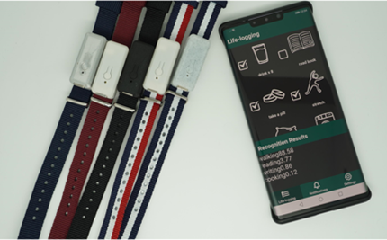
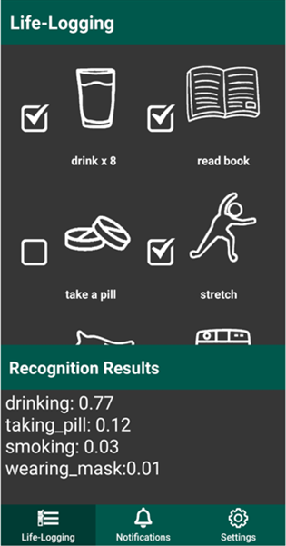
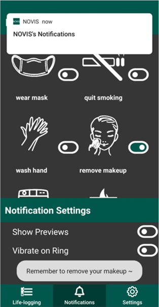
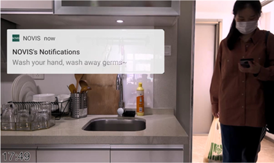

### 2020/07 - Present

  * An off-the-shelf edge device NOVIS that could passively recognize user activities. It can be used in the wild with context-aware activity recognition, in other words, it can function well in people¡¯s daily life outside the ideal condition of the laboratory.
  * A namesake interactive system that complements the device in a way that automatically ticks for your lifelogging items, and sends notifications based on individualized scenarios. At the time the study took place, wearable systems that could accomplish the same functionality were not yet available.
  
#### Demo

        
        <figcaption>Wristband prototype & Application</figcaption>

    

        
        <figcaption></figcaption>
    

    

        
        <figcaption></figcaption>
    

        
        <figcaption></figcaption>

